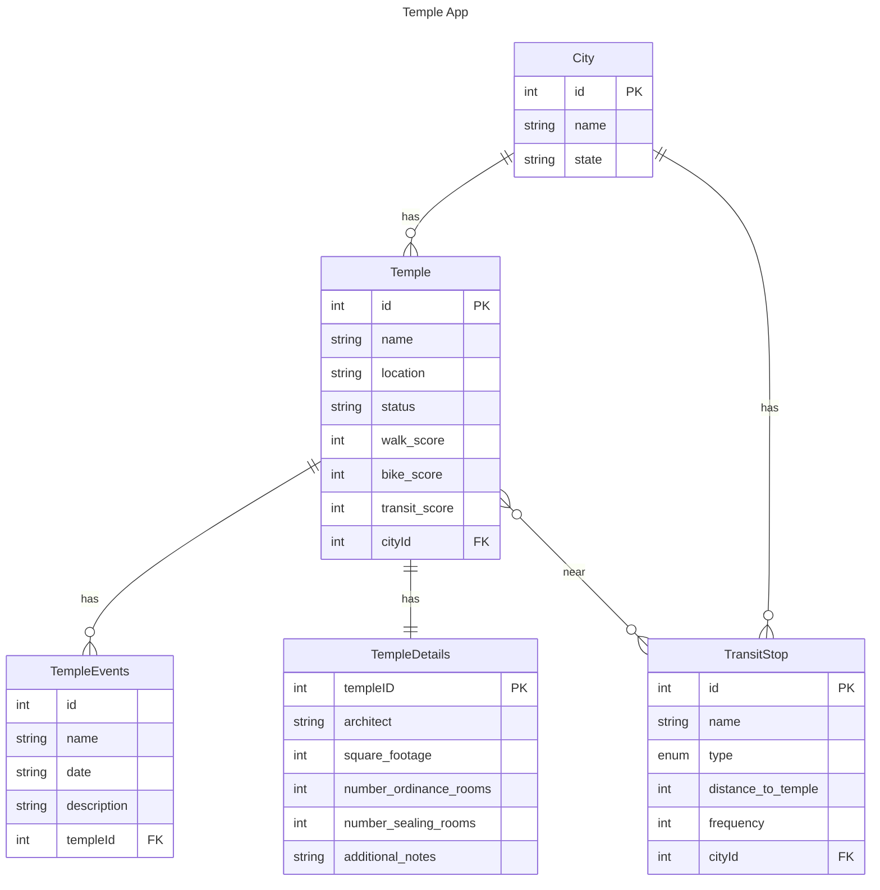

```mermaid
---
title: Temple App
---

erDiagram
	Temple {
		int id PK
		string name
		string location
		string status
        int walk_score
        int bike_score
        int transit_score
        int cityId FK
	}
    City {
        int id PK
        string name
        string state
    }
    TransitStop {
        int id PK
        string name
        enum type
        int distance_to_temple
        int frequency
        int cityId FK
    }
    TempleEvents {
        int id
        string name
        string date
        string description
        int templeId FK
    }
    TempleDetails {
        int templeID PK
        string architect
        int square_footage
        int number_ordinance_rooms
        int number_sealing_rooms
        string additional_notes
    }

    %% Relationships
    City ||--o{ Temple : "has"
    Temple ||--o{ TempleEvents : "has"
    Temple ||--|| TempleDetails : "has" 
    City ||--o{ TransitStop : "has"
    Temple }o--o{ TransitStop : "near"


```